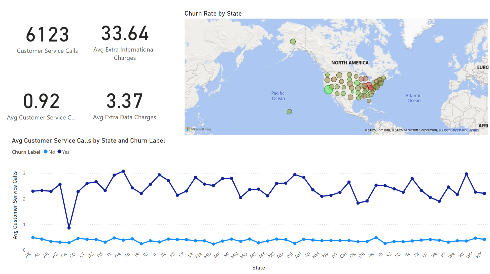

# 📉 Customer Churn Dashboard – Power BI Analytics

This project provides a comprehensive analysis of customer churn using Power BI, with the goal of identifying key drivers behind attrition and enabling data-driven strategies to improve customer retention.

> 📊 Built using Power BI – showcasing dynamic visualizations across contract types, demographics, service usage, and geographic distribution.

---

## 🎯 Objective

To understand:
- Who is churning and why
- How customer behavior, demographics, and services impact churn
- What actions can reduce churn and improve long-term customer loyalty

---

## 🧩 Key Dashboard Sections

### 1. **Churn Overview**
- Total Churn Rate: **26.86%**
- Churned Customers: **1,796 out of 6,687**
- Senior citizens and users of unlimited data plans have the highest churn rates
- Top churn reasons: Competitor pricing, customer support attitude, and service dissatisfaction

### 2. **Demographics & Behavior**
- Younger users churn less compared to senior customers
- Monthly contracts lead to significantly higher churn (**46.29%**) than yearly contracts (**6.62%**)
- Higher group size correlates with lower churn rates

### 3. **Contract & Payment Insights**
- Churn rate declines as account age increases
- Month-to-month contracts show volatile churn trends across different durations
- Paper check users are least common but show higher churn in some segments

### 4. **Data Plan & Usage**
- Unlimited plan users churn at **32.11%**, nearly double that of capped users
- Users consuming **less than 5GB** are more stable compared to heavy users

### 5. **Geographic Churn**
- Churn is highest in some western states (e.g., California), while midwest/east coast states perform better
- Visualized via an interactive map layer

---

## 🖥️ Sample Dashboards

| Churn Overview | Contract Type & Payment | Geo Insights |
|----------------|--------------------------|--------------|
|  |  |  |

*(Rename your screenshots to match the filenames above for perfect rendering on GitHub)*

---

## 💡 Key Takeaways

- Customers on **monthly contracts**, **senior citizens**, and those with **unlimited plans** are most likely to churn
- **Customer service dissatisfaction** and **competitor offerings** dominate churn reasons
- Opportunity exists to **convert monthly users to long-term contracts** and **target high-churn states** with specific interventions

---

## 📁 Files Included

- `.pbix` (Power BI Dashboard file – *to be uploaded*)
- Multiple `.png` screenshots of each dashboard tab for GitHub preview
- This `README.md` file for project overview

---

## 🔧 Tools & Techniques

- Power BI Desktop  
- DAX Measures and Slicers  
- Custom visual interactions  
- Geographic mapping with Bing Maps  
- Segmentation by contract type, group size, age, and consumption

---

## 🧠 Author

**Sahibnoor Chahal**  
MSBA Candidate – UMass Amherst  
Project: Customer Retention Analytics using Power BI

---

